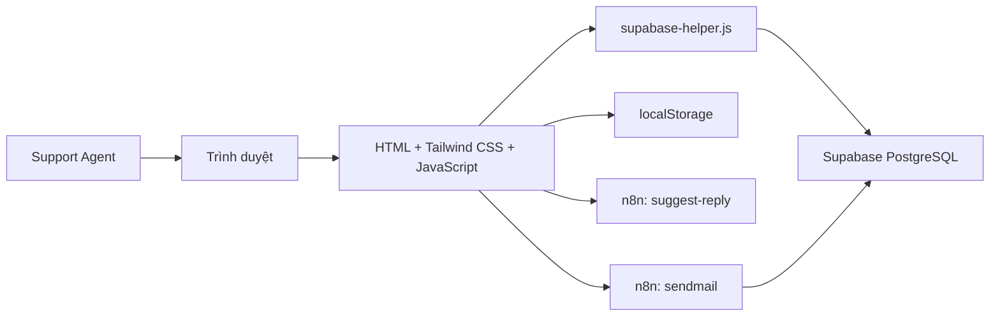
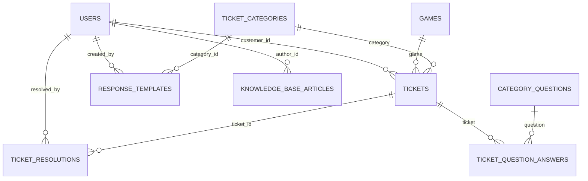

# Game Support Agent Portal

Hệ thống quản trị dành cho đội ngũ chăm sóc khách hàng của nền tảng game. Ứng dụng giúp nhân viên hỗ trợ theo dõi hàng đợi ticket, xem nội dung yêu cầu, soạn và gửi phản hồi, sử dụng gợi ý từ AI, quản lý mẫu trả lời và duy trì kho câu hỏi thường gặp.

Dự án được xây dựng dưới dạng website tĩnh bằng HTML, Tailwind CSS và Vanilla JavaScript. Giao diện chạy trực tiếp trên trình duyệt, lấy dữ liệu từ Supabase và gọi các workflow n8n cho chức năng gợi ý phản hồi và gửi email.

## Mục lục

- [Tính năng chính](#tính-năng-chính)
- [Công nghệ sử dụng](#công-nghệ-sử-dụng)
- [Kiến trúc hệ thống](#kiến-trúc-hệ-thống)
- [Cấu trúc dự án](#cấu-trúc-dự-án)
- [Hướng dẫn chạy dự án](#hướng-dẫn-chạy-dự-án)
- [Cấu hình Supabase](#cấu-hình-supabase)
- [Mô hình dữ liệu](#mô-hình-dữ-liệu)
- [Tích hợp n8n](#tích-hợp-n8n)
- [Dữ liệu lưu trên trình duyệt](#dữ-liệu-lưu-trên-trình-duyệt)
- [Quy ước phát triển](#quy-ước-phát-triển)
- [Bảo mật và giới hạn hiện tại](#bảo-mật-và-giới-hạn-hiện-tại)

## Tính năng chính

### 1. Đăng nhập nhân viên hỗ trợ

Trang `login.html` cung cấp biểu mẫu đăng nhập bằng email và mật khẩu:

- Chỉ chấp nhận tài khoản có vai trò `AGENT` hoặc `ADMIN`.
- Tải Supabase JavaScript SDK và `bcryptjs` trực tiếp từ CDN.
- Đọc bản ghi tài khoản từ bảng `users`.
- So sánh mật khẩu nhập vào với `password_hash` bằng bcrypt.
- Lưu thông tin phiên hiện tại vào `localStorage`.
- Tự động chuyển người dùng đã đăng nhập đến `index.html`.
- Hỗ trợ hiện hoặc ẩn mật khẩu.

Các trang quản trị gọi `checkAuth()` trong `shared.js`. Nếu không có phiên hợp lệ trong trình duyệt, người dùng được chuyển về `login.html`.

> Cơ chế này là xác thực tùy chỉnh phía trình duyệt, không phải Supabase Auth. Xem phần [Bảo mật và giới hạn hiện tại](#bảo-mật-và-giới-hạn-hiện-tại) trước khi triển khai thực tế.

### 2. Dashboard vận hành

Trang `index.html` tổng hợp dữ liệu ticket thành các chỉ số và biểu đồ:

- Tổng ticket chưa giải quyết.
- Tỷ lệ đáp ứng SLA.
- Thời gian xử lý trung bình.
- Phân bố ticket theo `Open`, `Drafting` và `Resolved`.
- Phân bố ticket theo danh mục hỗ trợ.
- Danh sách ticket gần đây.
- Tìm ticket theo từ khóa.
- Lọc dữ liệu theo khoảng ngày bằng bộ chọn lịch hai cột.

Tỷ lệ SLA được tính từ số ticket chưa giải quyết và số ticket đang quá hạn:

```text
SLA Compliance =
  (Unresolved Tickets - Overdue Unresolved Tickets)
  / Unresolved Tickets
  × 100
```

Thời gian xử lý trung bình được tính từ trường `handle_time` của các ticket đã giải quyết. Khi dữ liệu không có giá trị phù hợp, giao diện sử dụng mốc 15 phút làm giá trị tham chiếu.

Biểu đồ trạng thái được dựng bằng CSS. Biểu đồ danh mục sử dụng SVG và tính các cung tròn trực tiếp bằng JavaScript, không phụ thuộc thư viện biểu đồ.

Khi nhấn vào một danh mục hoặc tìm kiếm từ dashboard, điều kiện lọc được lưu tạm trong `localStorage` rồi chuyển sang `ticket_list.html`.

### 3. Danh sách ticket

Trang `ticket_list.html` hiển thị hàng đợi yêu cầu hỗ trợ:

- Tìm kiếm ticket theo nội dung hiển thị.
- Lọc theo danh mục và trạng thái.
- Nhận điều kiện lọc được chuyển từ dashboard.
- Phân trang phía trình duyệt, 10 ticket mỗi trang.
- Hiển thị mã ticket, khách hàng, game, danh mục, ngày tạo và trạng thái.
- Chọn ticket và mở không gian xử lý chi tiết.

Ticket được chọn được lưu bằng khóa `activeTicketId`, sau đó trang chuyển đến `ticket_detail.html`.

### 4. Không gian xử lý ticket

Trang `ticket_detail.html` là màn hình làm việc chính của nhân viên hỗ trợ:

- Hiển thị danh sách ticket đang hoạt động ở cột bên trái.
- Chuyển ticket ngay trên cùng trang mà không cần tải lại toàn bộ giao diện.
- Hiển thị khách hàng, email, game, hệ điều hành, danh mục và nội dung yêu cầu.
- Hiển thị câu hỏi sàng lọc và câu trả lời liên quan.
- Hiển thị lịch sử trao đổi giữa khách hàng và nhân viên.
- Soạn phản hồi trong trình biên tập.
- Chèn mẫu phản hồi có sẵn.
- Cảnh báo trước khi ghi đè nội dung đang soạn.
- Tự động lưu bản nháp theo từng ticket vào `localStorage`.
- Khôi phục hoặc xóa bản nháp khi mở lại ticket.
- Lưu trạng thái `Drafting` khi nhân viên lưu nháp.
- Yêu cầu AI tạo gợi ý trả lời qua webhook n8n.
- Lưu gợi ý AI vào cột `tickets.ai_suggestion`.
- Gửi email phản hồi qua webhook n8n.
- Sau khi gửi thành công, lưu resolution và chuyển ticket sang `Resolved`.

Nếu bảng `ticket_question_answers` không có dữ liệu, `supabase-helper.js` thử tách metadata từ phần cuối của `description`, bắt đầu bằng một trong hai marker:

```text
-- Chi tiết danh mục --
-- Category Details --
```

Các cặp `Tên trường: Giá trị` được chuyển thành câu hỏi sàng lọc. Khối metadata sau đó được loại khỏi phần mô tả chính trước khi hiển thị.

### 5. Quản lý mẫu phản hồi

Hai trang liên quan:

- `response_templates.html`: danh sách và quản lý mẫu.
- `add_response_template.html`: tạo mẫu mới.

Chức năng:

- Hiển thị mẫu theo danh mục.
- Tìm kiếm mẫu trả lời.
- Xem nội dung chi tiết.
- Sao chép nội dung vào clipboard.
- Tạo, sửa, xuất bản hoặc xóa mẫu.
- Chèn placeholder như `[Customer Name]` và `[Ticket ID]`.
- Chọn ticket đang hoạt động và đưa mẫu vào trình soạn thảo.
- Lưu mẫu nháp cục bộ khi chưa xuất bản.

Mẫu đã xuất bản được lưu trong bảng `response_templates`. Mẫu nháp được lưu bằng khóa `localDraftTemplates` trong trình duyệt và được gộp vào dữ liệu khi tải trang.

### 6. Quản lý FAQs

Hai trang liên quan:

- `faq_management.html`: danh sách và quản lý bài viết.
- `add_faq_article.html`: tạo bài viết mới.

Chức năng:

- Nhóm bài viết theo danh mục.
- Tìm kiếm theo tiêu đề, nội dung hoặc từ khóa.
- Xem chi tiết bài viết.
- Tạo, sửa, xuất bản hoặc xóa bài viết.
- Gắn danh sách từ khóa phân tách bằng dấu phẩy.
- Định dạng nội dung với in đậm, in nghiêng, gạch chân và heading.
- Lưu bài nháp trên trình duyệt.
- Giao diện tải ảnh minh họa bằng kéo thả.

Các bài đã xuất bản được lưu trong bảng `knowledge_base_articles`. Bài nháp dùng khóa `localDraftArticles`.

Phần chọn ảnh hiện mới xử lý ở giao diện; mã nguồn chưa upload tệp lên Supabase Storage hoặc dịch vụ lưu trữ khác.

### 7. Giao diện dùng chung

`shared.js` cung cấp:

- Đối tượng dữ liệu dùng chung `window.DB`.
- Kiểm tra phiên và đăng xuất.
- Thanh điều hướng dùng chung.
- Hiển thị tên và avatar của nhân viên.
- Toast thông báo.
- Chuyển giao diện sáng/tối.
- Đồng bộ trạng thái ticket với bản nháp cục bộ.

Theme được lưu trong `localStorage`, nhờ đó lựa chọn sáng hoặc tối được giữ lại giữa các lần mở trang.

## Công nghệ sử dụng

| Thành phần | Công nghệ |
|---|---|
| Giao diện | HTML5 |
| Styling | Tailwind CSS qua CDN |
| Ngôn ngữ | Vanilla JavaScript ES6+ |
| Font | Google Fonts |
| Biểu tượng | Material Symbols |
| Backend as a Service | Supabase |
| Cơ sở dữ liệu | Supabase PostgreSQL |
| API dữ liệu | Supabase JavaScript SDK 2 |
| So sánh mật khẩu | bcryptjs 2.4.3 |
| Workflow tự động hóa | n8n Webhook |
| Lưu trạng thái phía client | Web Storage API |

Dự án không có `package.json`, framework frontend, bundler hoặc bước build.

## Kiến trúc hệ thống



Mỗi trang HTML là một màn hình độc lập, chứa phần lớn giao diện và logic riêng của màn hình đó. Hai tệp JavaScript dùng chung là:

- `shared.js`: phiên cục bộ, navigation, theme, toast và dữ liệu trong bộ nhớ.
- `supabase-helper.js`: khởi tạo SDK, truy vấn dữ liệu, biến đổi dữ liệu và thao tác ghi Supabase.

Khi tải một trang quản trị, luồng chính thường là:

1. Kiểm tra `currentUser`.
2. Khởi tạo `DB_Helper`.
3. Tải dữ liệu từ Supabase vào `window.DB`.
4. Gộp các bản nháp đang nằm trong `localStorage`.
5. Render giao diện và gắn các sự kiện tương tác.

## Cấu trúc dự án

```text
admin_view/
├── index.html
├── login.html
├── ticket_list.html
├── ticket_detail.html
├── response_templates.html
├── add_response_template.html
├── faq_management.html
├── add_faq_article.html
├── shared.js
├── supabase-helper.js
├── test_delete.ps1
├── readme.md
└── .gitignore
```

| Tệp | Vai trò |
|---|---|
| `login.html` | Đăng nhập nhân viên |
| `index.html` | Dashboard KPI, biểu đồ và bộ lọc ngày |
| `ticket_list.html` | Danh sách, tìm kiếm, lọc và phân trang ticket |
| `ticket_detail.html` | Xử lý ticket, bản nháp, AI và gửi phản hồi |
| `response_templates.html` | Quản lý mẫu phản hồi |
| `add_response_template.html` | Tạo mẫu phản hồi |
| `faq_management.html` | Quản lý FAQs |
| `add_faq_article.html` | Tạo bài FAQ |
| `shared.js` | Tiện ích và UI dùng chung |
| `supabase-helper.js` | Kết nối và thao tác dữ liệu Supabase |
| `test_delete.ps1` | Script thử gọi REST DELETE cho một template cụ thể |

## Hướng dẫn chạy dự án

### Yêu cầu

- Trình duyệt hiện đại.
- Kết nối Internet để tải Tailwind CSS, Supabase SDK, bcryptjs, Google Fonts và Material Symbols.
- Python, Node.js hoặc một HTTP server tĩnh tương đương.
- Supabase project có schema và policy tương thích.
- Các workflow n8n đang hoạt động nếu cần gợi ý AI và gửi email.

### Clone repository

```powershell
git clone https://github.com/bichngocwork-ba/admin_view.git
cd admin_view
```

### Chạy bằng Python

```powershell
py -m http.server 8080
```

Sau đó truy cập:

```text
http://localhost:8080/login.html
```

Nếu máy sử dụng lệnh `python`:

```powershell
python -m http.server 8080
```

### Chạy bằng Node.js

```powershell
npx serve .
```

Không nên mở trực tiếp bằng `file://`, vì hành vi tải script CDN, request API và điều hướng có thể khác so với khi chạy qua HTTP.

## Cấu hình Supabase

Thông tin kết nối hiện được khai báo trực tiếp ở đầu `supabase-helper.js`:

```javascript
const SUPABASE_URL = "https://<project-ref>.supabase.co";
const SUPABASE_KEY = "<anon-key>";
```

Client được khởi tạo tại:

```javascript
window.DB_Helper.client
```

Anon key có thể xuất hiện trong frontend, nhưng quyền truy cập thực tế phải được kiểm soát bằng Row Level Security, database grants và RPC phù hợp. Không đưa `service_role` key vào repository hoặc mã chạy trên trình duyệt.

### RPC được sử dụng

| RPC | Tham số | Mục đích |
|---|---|---|
| `delete_response_template` | `template_id` | Xóa mẫu phản hồi |
| `delete_kb_article` | `article_id` | Xóa bài FAQ |

Nếu RPC không tồn tại, frontend thử `DELETE` trực tiếp trên bảng. Thao tác chỉ thành công khi policy cho phép.

Repository không chứa migration SQL, do đó schema, enum, foreign key, RLS policy và function phải được thiết lập riêng trong Supabase.

## Mô hình dữ liệu

Mô hình dưới đây được tổng hợp từ các câu truy vấn và payload thực tế trong mã nguồn.



### `users`

Các cột được frontend sử dụng:

- `id`
- `email`
- `full_name`
- `role`: `AGENT` hoặc `ADMIN`
- `password_hash`

### `tickets`

- `id`
- `ticket_number`
- `customer_id`
- `game_id` hoặc quan hệ `game`
- `category_id` hoặc quan hệ `category`
- `description`
- `status`: frontend đọc `OPEN`, `DRAFTING`, `IN_PROGRESS`, `RESOLVED`
- `priority`: frontend đọc `LOW`, `MEDIUM`, `HIGH`, `URGENT`
- `ai_suggestion`
- `overdue`
- `handle_time`
- `created_at`
- `updated_at`

Khi ghi trạng thái, giao diện ánh xạ:

| Trạng thái UI | Giá trị Supabase |
|---|---|
| `Open` | `OPEN` |
| `Drafting` | `IN_PROGRESS` |
| `Resolved` | `RESOLVED` |

### `games`

- `id`
- `game_name`

### `ticket_categories`

- `id`
- `category_name`

### `category_questions`

- `id`
- `field_key`
- `question_label`

### `ticket_question_answers`

- `ticket_id`
- `question_id`
- `answer_value`

### `ticket_resolutions`

- `id`
- `ticket_id`
- `resolution_content`
- `resolved_by`
- `resolved_at`

### `response_templates`

- `id`
- `template_name`
- `category_id`
- `template_content`
- `created_by`
- `is_published`
- `created_at`
- `updated_at`

### `knowledge_base_articles`

- `id`
- `title`
- `category`
- `content`
- `tags`: frontend đang xử lý dưới dạng chuỗi phân tách bằng dấu phẩy
- `author_id`
- `view_count`
- `is_published`
- `created_at`
- `updated_at`

## Tích hợp n8n

### Gợi ý phản hồi bằng AI

`ticket_detail.html` gửi request `POST` đến webhook `suggest-reply` với payload:

```json
{
  "message": "Nội dung ticket",
  "customerName": "Tên khách hàng",
  "customerEmail": "customer@example.com",
  "category": "Technical Issues",
  "priority": "High",
  "ticketId": "TCK-12345"
}
```

Phản hồi được đưa vào vùng gợi ý AI và có thể được chèn vào trình soạn thảo. Nội dung cũng được lưu vào `tickets.ai_suggestion`.

### Gửi email

Webhook `sendmail` nhận payload:

```json
{
  "action": "send_mail",
  "ticketId": "TCK-12345",
  "customerName": "Tên khách hàng",
  "customerEmail": "customer@example.com",
  "subject": "Re: Ticket subject",
  "replyText": "Nội dung phản hồi"
}
```

Sau khi webhook báo thành công, frontend:

1. Cập nhật ticket sang `RESOLVED`.
2. Thêm bản ghi vào `ticket_resolutions`.
3. Xóa bản nháp cục bộ.
4. Chuyển giao diện sang chế độ chỉ đọc.

URL webhook hiện được viết trực tiếp trong `ticket_detail.html`. Khi triển khai môi trường khác, cần thay URL hoặc đưa cấu hình ra một tệp riêng.

## Dữ liệu lưu trên trình duyệt

| Khóa | Nội dung |
|---|---|
| `currentUser` | Thông tin nhân viên đang đăng nhập |
| `theme` | `light` hoặc `dark` |
| `activeTicketId` | Ticket đang được chọn |
| `ticketDrafts` | Nội dung phản hồi nháp theo ticket |
| `localDraftTemplates` | Mẫu phản hồi chưa xuất bản |
| `localDraftArticles` | Bài FAQ chưa xuất bản |
| `prefilter_category` | Danh mục chuyển từ dashboard |
| `prefilter_search` | Từ khóa chuyển từ dashboard |

Dữ liệu `localStorage` chỉ tồn tại trên cùng trình duyệt và thiết bị. Các bản nháp này không tự đồng bộ giữa nhiều máy, tài khoản trình duyệt hoặc cửa sổ riêng tư.

## Quy ước phát triển

- Dùng `async/await` cho thao tác Supabase và webhook.
- Truy cập backend qua `window.DB_Helper`.
- Dữ liệu đang hiển thị được giữ trong `window.DB`.
- Dùng Tailwind utility classes; CSS riêng nằm trong từng trang.
- Các trang dùng đường dẫn tương đối để có thể chạy trên static host.
- Mỗi trang cần đăng nhập phải gọi `checkAuth()`.
- Thay đổi dữ liệu phải cập nhật Supabase trước khi cập nhật giao diện.
- Các bản nháp cục bộ cần được xóa sau khi xuất bản hoặc gửi thành công.
- Không commit service key, mật khẩu thật hoặc credential n8n.

## Bảo mật và giới hạn hiện tại

### 1. Xác thực phía trình duyệt

Frontend truy vấn `users.password_hash` bằng anon key và chạy bcrypt trong trình duyệt. Cách làm này khiến hash mật khẩu có thể bị đọc bởi client nếu RLS cho phép truy vấn đăng nhập, đồng thời `currentUser` có thể bị sửa trong DevTools.

Đối với production, nên chuyển sang Supabase Auth hoặc một API/Edge Function phía server. Client chỉ nên nhận session token, không được đọc `password_hash`.

### 2. Phân quyền

Ẩn nút hoặc kiểm tra `currentUser` không phải cơ chế bảo mật đầy đủ. Tất cả bảng, view, RPC và thao tác ghi phải có RLS policy hoặc kiểm tra quyền phía server.

Đặc biệt, RPC dùng `SECURITY DEFINER` chỉ nên:

- Xác minh danh tính người gọi.
- Kiểm tra vai trò được phép.
- Đặt `search_path` an toàn.
- Chỉ nhận và xử lý đúng bản ghi cần thiết.
- Không cấp `EXECUTE` rộng hơn nhu cầu.

### 3. Tính toàn vẹn khi gửi phản hồi

Gửi email và cập nhật trạng thái ticket là hai request riêng biệt. Email có thể đã gửi nhưng thao tác ghi Supabase thất bại, hoặc ngược lại. Production nên dùng một backend workflow có idempotency và cập nhật dữ liệu theo một quy trình có kiểm soát.

### 4. Secrets và endpoint

Anon key và webhook URL đang được viết trực tiếp trong frontend. Anon key chỉ an toàn khi RLS đúng; webhook công khai cần xác thực, giới hạn tần suất, CORS phù hợp và kiểm tra payload.

### 5. Draft cục bộ

Mẫu phản hồi và FAQ ở trạng thái nháp chỉ nằm trong `localStorage`. Xóa dữ liệu trình duyệt sẽ làm mất draft. Draft cũng không được chia sẻ giữa nhân viên.

### 6. Chất lượng và triển khai

Repository hiện chưa có:

- Migration Supabase.
- Dữ liệu mẫu.
- Test tự động.
- Linter hoặc formatter.
- Pipeline CI/CD.
- Quản lý cấu hình theo môi trường.
- Quy trình upload ảnh FAQ hoàn chỉnh.

Trước khi dùng trong môi trường thực tế, nên bổ sung migration có version, kiểm thử các luồng quan trọng, logging, xử lý lỗi tập trung và tách cấu hình development/staging/production.

## Phạm vi dự án

Đây là giao diện quản trị phục vụ mô phỏng quy trình hỗ trợ khách hàng trong lĩnh vực game. Dự án phù hợp cho học tập, trình diễn luồng nghiệp vụ và phát triển prototype. Các giới hạn bảo mật và vận hành nêu trên cần được xử lý trước khi hệ thống quản lý dữ liệu khách hàng thực tế.
